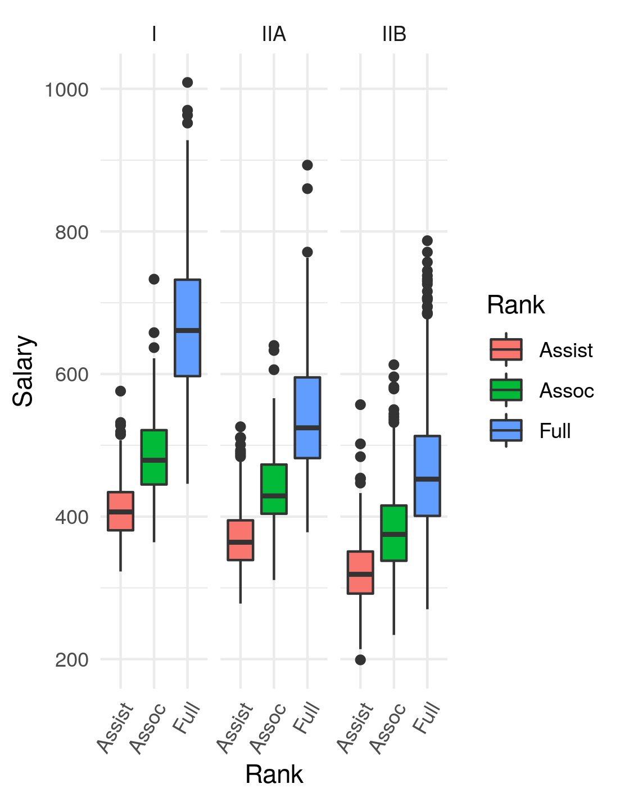

```{r setup, include=FALSE}
#knitr::opts_chunk$set(echo = TRUE)
knitr::opts_chunk$set(warning = FALSE, message = FALSE) 

library(tidyverse)
library(janitor)
library(easystats)
library(broom)
library(kableExtra)
library(pander)
```

## Reading in data

```{r reads}
r.sal <- read.csv("FacultySalaries_1995.csv")
r.oil <- read.csv("Juniper_Oils.csv")
```

## Faculty Salaries 1995

Here we are going to be cleaning the data because as you can see, the data is rather messy, especially if we want to make a graph that looks like this:


```{r cleaning1}
n_cols <- names(r.sal) |>
  str_match("Avg.*Salary.*") |>
  na.omit() |>
  c()
 

sal <- r.sal |>
  pivot_longer(cols = all_of(n_cols),names_to = "rank",values_to = "salary")|>
  mutate(rank = case_when(
    rank == "AvgFullProfSalary" ~ "Full",
    rank == "AvgAssocProfSalary" ~ "Assoc",
    rank == "AvgAssistProfSalary" ~ "Assist",
    rank == "AvgProfSalaryAll" ~ "All",
  ))|> 
  filter(rank != "All")|>
  mutate(
    salary=as.numeric(salary),
    rank=as.factor(rank),
    Tier=as.factor(Tier))
```

Now that we've claned the data, we can recreate the plot:

```{r graph1}
sal |>
  filter(Tier!="VIIB")|>
  ggplot(aes(y=salary,x=Tier,fill=rank))+
  geom_boxplot()
```

### Statistical Tests

Now we will be using the ANOVA test to look at the interaction of Tier, Rank, and State on Salary.

```{r ANOVA}
s.aov <- sal |>
  aov(salary~State+Tier+rank,data=_)

summary(s.aov) |>
  pander()

report(s.aov)|>
  pander()
```

## Juniper Oils

We are going to be trying to recreate the following graph:


First, before we can do anything else, we need to clean our data:

```{r cleaning2}
cols.oil = c("alpha-pinene","para-cymene","alpha-terpineol","cedr-9-ene","alpha-cedrene","beta-cedrene","cis-thujopsene","alpha-himachalene","beta-chamigrene","cuparene","compound-1","alpha-chamigrene","widdrol","cedrol","beta-acorenol","alpha-acorenol","gamma-eudesmol","beta-eudesmol","alpha-eudesmol","cedr-8-en-13-ol","cedr-8-en-15-ol","compound-2","thujopsenal")

names <- colnames(r.oil)|>
  str_replace_all("\\.","-")

i.oil <- r.oil
colnames(i.oil) <- names

c.oil <- i.oil |>
  pivot_longer(cols=cols.oil,names_to="ChemicalID",values_to="Concentration")
```

And now that we have done that we can recreate the graph:

```{r graph2}
c.oil |>
  ggplot(aes(x=YearsSinceBurn,y=Concentration))+
  facet_wrap(~ChemicalID,scales="free")+
  geom_smooth()
```

And finally, let us take a look at a general linear model that will try to see what sorts of correllations are present in our data.

```{r glm}
o.glm <- c.oil |>
  glm(Concentration ~ ChemicalID*YearsSinceBurn, data = _)

o.glm|>
  summary()

o.glm |>
  tidy()|>
  filter(p.value < 0.05)|>
  pander()
```

